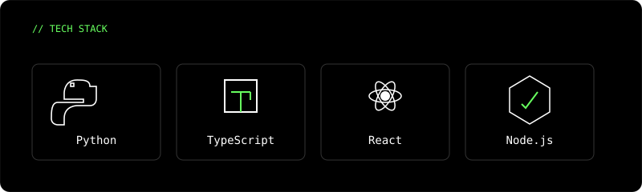

<table width="100%" border="0" cellspacing="0" cellpadding="0" style="background-color: #000000; border-collapse: collapse;">
  <tr>
    <td align="center" style="padding: 20px 0;">
      
      <!-- HERO SECTION -->
      
      
      <!-- MISSION SECTION -->
      
      
      <!-- BOOT SEQUENCE -->
      
      
      <!-- CURRENT FOCUS CAROUSEL -->
      
      
      <!-- WAVEFORM -->
      
      
      <!-- LIVE STATS -->
      <table width="800" border="0" cellspacing="0" cellpadding="0" style="margin-top: 24px;">
        <tr>
          <td align="center" style="padding: 10px;">
            
          </td>
          <td align="center" style="padding: 10px;">
            
          </td>
        </tr>
      </table>

      <!-- FEATURED PROJECTS -->
      <table width="800" border="0" cellspacing="0" cellpadding="0" style="margin-top: 24px; border: 1px solid #FFFFFF20; border-radius: 12px;">
        <tr>
          <td align="left" style="padding: 24px; font-family: monospace; color: #FFFFFF;">
            <h3 style="color: #67FF5F; margin-top: 0; margin-bottom: 16px; font-size: 18px;">// FEATURED PROJECTS</h3>
            <table width="100%" border="0" cellspacing="0" cellpadding="0">
              <tr>
                <td width="50%" valign="top" style="padding: 12px; border: 1px solid #FFFFFF20; border-radius: 8px; background-color: #050505;">
                  <a href="https://github.com/dhanvi/GemmAgent" style="color: #FFFFFF; text-decoration: none; font-weight: bold; font-size: 16px;">GemmAgent</a>
                   
                  Developer-first AI agent framework for complex workflows.
                </td>
                <td width="50%" valign="top" style="padding: 12px; border: 1px solid #FFFFFF20; border-radius: 8px; background-color: #050505;">
                  <a href="https://github.com/DhanviND360/HireQuest" style="color: #FFFFFF; text-decoration: none; font-weight: bold; font-size: 16px;">HireQuest</a>
                   
                  Full-stack AI-powered recruitment and matching platform.
                </td>
              </tr>
              <tr>
                <td width="50%" valign="top" style="padding: 12px; border: 1px solid #FFFFFF20; border-radius: 8px; background-color: #050505;">
                  <a href="https://github.com/dhanvi/NeuralCore" style="color: #FFFFFF; text-decoration: none; font-weight: bold; font-size: 16px;">NeuralCore</a>
                   
                  LLM engineering toolkit for fine-tuning and inference.
                </td>
                <td width="50%" valign="top" style="padding: 12px; border: 1px solid #FFFFFF20; border-radius: 8px; background-color: #050505;">
                  <a href="https://github.com/dhanvi/TerminalUI" style="color: #FFFFFF; text-decoration: none; font-weight: bold; font-size: 16px;">TerminalUI</a>
                   
                  Minimalist monochrome UI components for web apps.
                </td>
              </tr>
            </table>
          </td>
        </tr>
      </table>

      <!-- TECH STACK -->
      

      <!-- CONTRIBUTION GRAPH -->
      

      <!-- MISSION TERMINAL / CONTACT -->
      <table width="800" border="0" cellspacing="0" cellpadding="0" style="margin-top: 24px; border: 1px solid #FFFFFF20; border-radius: 12px; background-color: #000000;">
        <tr>
          <td align="left" style="padding: 24px; font-family: monospace; color: #FFFFFF;">
            root@dhanvi-os:~$ establish_connection --target=visitor 
            [INFO] Initializing secure channel... 
            [INFO] Encryption enabled (AES-256). 
            [SUCCESS] Connection established. 
             
            root@dhanvi-os:~$ cat contact_info.json 
             
            &nbsp;&nbsp;{ 
            &nbsp;&nbsp;&nbsp;&nbsp;"email": "dhanvi@example.com", 
            &nbsp;&nbsp;&nbsp;&nbsp;"portfolio": "dhanvi.dev", 
            &nbsp;&nbsp;&nbsp;&nbsp;"status": "Available for Work", 
            &nbsp;&nbsp;&nbsp;&nbsp;"location": "Remote / Global" 
            &nbsp;&nbsp;} 
             
            root@dhanvi-os:~$ _
          </td>
        </tr>
      </table>

      

        SYSTEM BUILD v2.4.1 // ARCHITECTURE: MONOLITHIC SVG // UPTIME: 99.9%
      

    </td>
  </tr>
</table>
