 

 

 

## &gt; CURRENT FOCUS

 

## &gt; ACTIVITY

 

## &gt; LIVE STATS

 

## &gt; FEATURED PROJECTS

 

## &gt; TECH STACK

 

## &gt; CONTRIBUTION GRAPH

 

## &gt; CONNECT

[]

[]

 

&gt; Thanks for visiting. Star a repo if you like the work. Let's build something together.

